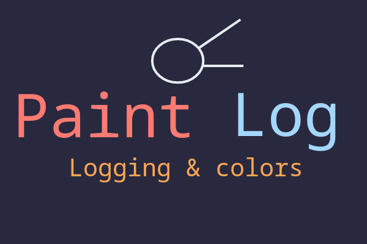

	

Logging for important Python applications will become more beautiful and functional!

 

    
    
    
    
    
     

> A new step, a new future

Paintlog will help you track and work with your Python applications easier and more functionally!

> [!CAUTION]
> At the moment, Paintlog is under active development, many things may not work, and this version is not recommended for use (all at your own risk).

## Contact and support
If you have questions about using Paintlog, then create an [issue](https://github.com/alexeev-engineer/paintlog/issues/new) in the repository or write to me at bro.alexeev@inbox.ru.

You can also write to me on Telegram: [@alexeev_dev](https://t.me/alexeev_dev)

paintlog is an Open Source project, and it only survives due to your feedback and support!

Project releases are available at [this link](https://github.com/alexeev-engineer/paintlog/releases).

## Documentation
You can read the usage documentation at [this link](./docs/index.md).

## Requirements
To run the software you will have to install the necessary programs and dependencies, such as:

 + Python interpreter (>=3.10)
 + PIP package manager (>=22.0)
 + Python libraries (listed in [requirements.txt](./requirements.txt))

## Functional
Here you can see what paintlog can already do and what else is planned to be added in the future:

 - [x] Transition from 16-bit real address mode to protected 32-bit mode
 - [ ] Create kernel in C language
 - [ ] Create screen driver
 - [ ] Create shell
 - [ ] Create keyboard driver
 - [ ] Create file system

## Copyright
Copyright © 2024, Alexeev Bronislav and Core86® LLC

All rights reversed
