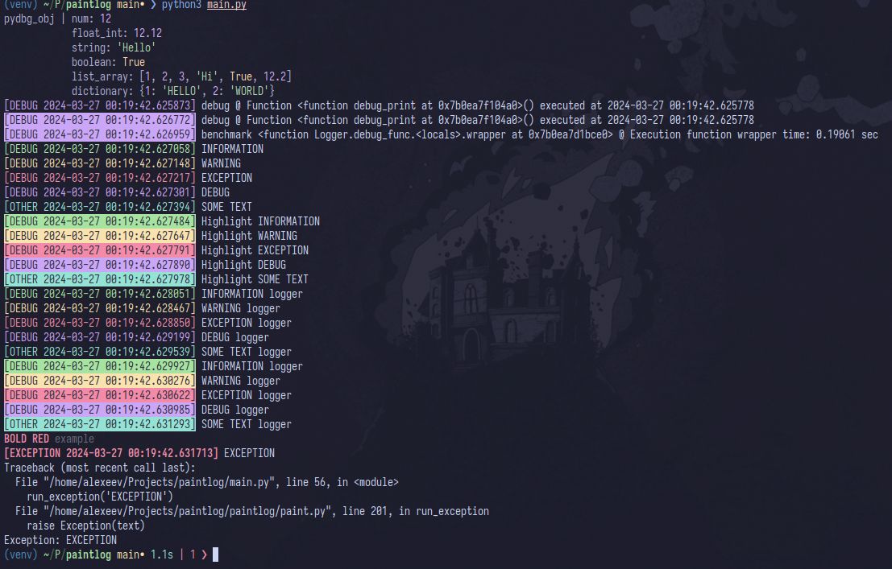

<h1 align="center">Paintlog documentation</h1>
<h2 align="center">Getting started</h2>

---

Here is an example of using paintlog:

```python
#!venv/bin/python3
"""Paintlog Example File.

Copyright Alexeev Bronislav (C) 2024
BSD 3 Clause License
"""
from paintlog.logger import pydbg_obj, benchmark, Logger
from paintlog.paint import info_message, warn_message, error_message, other_message, FG, Style, debug_message, run_exception

logger = Logger('main.log')


@benchmark
@logger.debug_func
def debug_print() -> list:
	num = 12
	float_int = 12.12
	string = 'Hello'
	boolean = True
	list_array = [1, 2, 3, 'Hi', True, 12.2]
	dictionary = {1: "HELLO", 2: "WORLD"}

	pydbg_obj(num, float_int, string, boolean, list_array, dictionary)


debug_print()

# Simple messages
info_message('INFORMATION')
warn_message('WARNING')
error_message('EXCEPTION')
debug_message('DEBUG')
other_message('SOME TEXT', 'OTHER')
# Highlight bg
info_message('Highlight INFORMATION', True)
warn_message('Highlight WARNING', True)
error_message('Highlight EXCEPTION', True)
debug_message('Highlight DEBUG', True)
other_message('Highlight SOME TEXT', 'OTHER', True)

# Message with logger
logger.log('INFORMATION logger', 'info')
logger.log('WARNING logger', 'warn')
logger.log('EXCEPTION logger', 'error')
logger.log('DEBUG logger', 'debug')
logger.log('SOME TEXT logger', 'other')
# Message with logger and highlight bg
logger.log('INFORMATION logger', 'info', True)
logger.log('WARNING logger', 'warn', True)
logger.log('EXCEPTION logger', 'error', True)
logger.log('DEBUG logger', 'debug', True)
logger.log('SOME TEXT logger', 'other', True)

print(f'{FG.red}{Style.bold}BOLD RED{Style.reset}{Style.dim} example{Style.reset}')

run_exception('EXCEPTION')

>> OUTPUT:
pydbg_obj | num: 12
            float_int: 12.12
            string: 'Hello'
            boolean: True
            list_array: [1, 2, 3, 'Hi', True, 12.2]
            dictionary: {1: 'HELLO', 2: 'WORLD'}
[DEBUG 2024-03-27 00:19:17.653308] debug @ Function <function debug_print at 0x7d57979ec4a0>() executed at 2024-03-27 00:19:17.653213
[DEBUG 2024-03-27 00:19:17.655379] debug @ Function <function debug_print at 0x7d57979ec4a0>() executed at 2024-03-27 00:19:17.653213
[DEBUG 2024-03-27 00:19:17.655637] benchmark <function Logger.debug_func.<locals>.wrapper at 0x7d57977fbce0> @ Execution function wrapper time: 0.22121 sec
[DEBUG 2024-03-27 00:19:17.655855] INFORMATION
[DEBUG 2024-03-27 00:19:17.655943] WARNING
[DEBUG 2024-03-27 00:19:17.656027] EXCEPTION
[DEBUG 2024-03-27 00:19:17.656110] DEBUG
[OTHER 2024-03-27 00:19:17.656199] SOME TEXT
[DEBUG 2024-03-27 00:19:17.656286] Highlight INFORMATION
[DEBUG 2024-03-27 00:19:17.656355] Highlight WARNING
[DEBUG 2024-03-27 00:19:17.656421] Highlight EXCEPTION
[DEBUG 2024-03-27 00:19:17.656504] Highlight DEBUG
[OTHER 2024-03-27 00:19:17.656590] Highlight SOME TEXT
[DEBUG 2024-03-27 00:19:17.656712] INFORMATION logger
[DEBUG 2024-03-27 00:19:17.657170] WARNING logger
[DEBUG 2024-03-27 00:19:17.657492] EXCEPTION logger
[DEBUG 2024-03-27 00:19:17.657869] DEBUG logger
[OTHER 2024-03-27 00:19:17.658186] SOME TEXT logger
[DEBUG 2024-03-27 00:19:17.658502] INFORMATION logger
[DEBUG 2024-03-27 00:19:17.658900] WARNING logger
[DEBUG 2024-03-27 00:19:17.659250] EXCEPTION logger
[DEBUG 2024-03-27 00:19:17.659555] DEBUG logger
[OTHER 2024-03-27 00:19:17.659936] SOME TEXT logger
BOLD RED example
[EXCEPTION 2024-03-27 00:19:17.660295] EXCEPTION
Traceback (most recent call last):
  File "/home/alexeev/Projects/paintlog/main.py", line 56, in <module>
    run_exception('EXCEPTION')
  File "/home/alexeev/Projects/paintlog/paintlog/paint.py", line 201, in run_exception
    raise Exception(text)
Exception: EXCEPTION
```

<p align="center">
    
</p>
